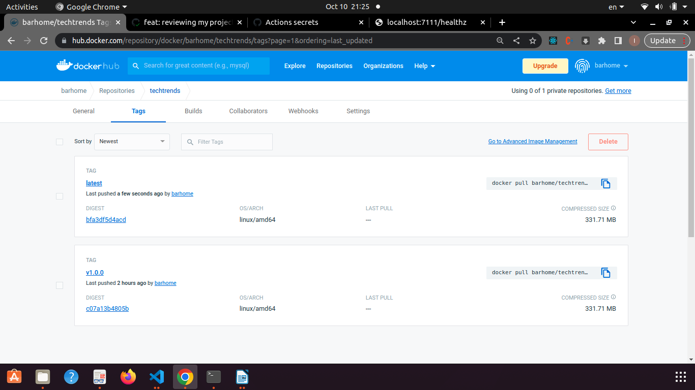
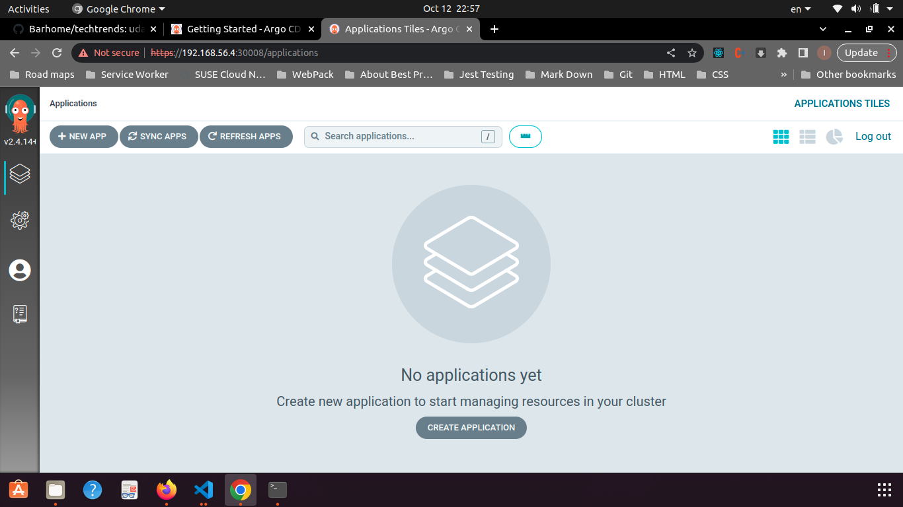

## Packaging Docker Application

- Change your directory to /techtrends where the Dockerfile is located

- run the command `docker build -t techtrends .` to spin up a docker container

- to run docker container in a detached mode and on port 7111 on your host run the command `docker run -d -p 7111:3111 techtrends`

- Test that the app is running on your host by hitting `http://localhost:7111/` in your browser

## Here is a screenshot of the app running locally:

## The docker logs command After adding logging functionalities metrics endpoint as a best practice in the development process we should check on that by doing the following:

- get the container ID by running the command `docker ps`

- retrieve the docker logs using container id c8633365188e by running the command `docker logs c8633365188e`

- You will get the following logs:

Serving Flask app "app" (lazy loading)
Environment: production
WARNING: This is a development server. Do not use it in a production deployment.
Use a production WSGI server instead.
Debug mode: off
Monday, 10/Oct/2022 at, 18:31:49 PM \* Running on http://0.0.0.0:3111/ (Press CTRL+C to quit)
Monday, 10/Oct/2022 at, 18:32:01 PM 172.17.0.1 - - [10/Oct/2022 18:32:01] "GET / HTTP/1.1" 200 -
Monday, 10/Oct/2022 at, 18:32:01 PM 172.17.0.1 - - [10/Oct/2022 18:32:01] "GET /static/css/main.css HTTP/1.1" 200 -
Monday, 10/Oct/2022 at, 18:32:01 PM 172.17.0.1 - - [10/Oct/2022 18:32:01] "GET /favicon.ico HTTP/1.1" 404 -
Monday, 10/Oct/2022 at, 18:32:35 PM 172.17.0.1 - - [10/Oct/2022 18:32:35] "GET / HTTP/1.1" 200 -
Monday, 10/Oct/2022 at, 18:36:43 PM The "About Us" page is retrieved
Monday, 10/Oct/2022 at, 18:36:43 PM 172.17.0.1 - - [10/Oct/2022 18:36:43] "GET /about HTTP/1.1" 200 -
Monday, 10/Oct/2022 at, 18:37:28 PM The "About Us" page is retrieved
Monday, 10/Oct/2022 at, 18:37:28 PM 172.17.0.1 - - [10/Oct/2022 18:37:28] "GET /about HTTP/1.1" 200 -
Monday, 10/Oct/2022 at, 18:38:57 PM 172.17.0.1 - - [10/Oct/2022 18:38:57] "GET /healthz HTTP/1.1" 200 -
Monday, 10/Oct/2022 at, 18:45:16 PM 172.17.0.1 - - [10/Oct/2022 18:45:16] "GET /healthz HTTP/1.1" 200 -
Monday, 10/Oct/2022 at, 18:45:19 PM 172.17.0.1 - - [10/Oct/2022 18:45:19] "GET /healthz HTTP/1.1" 200 -

## Continuous Integration With Github actions

- Create a configration file named techtrends-dockerhub.yaml in .github/workflows/ directory as in the project
- Create dockerhub token and github encrypted secrets that will be used inside of the configration file
- upon pushing new commits to github the configration file will the dockerhub token and github secrets to log in dockerhub and push new images.

## Here are screenshots of successful github action and new image on dockerhub

## Kubernetes cluster deployment using vagrant box and k3s

- run `vagrant up` in the directory that contains the vagrant file , The vagrant file has a command for automatically bootstrapping the kubernetes cluster using k3s
- run `vagrant ssh` and use `sudo su` to become root and use kubectl commands
- verify if the kubernetes cluster is operational by evaluating the node status in the cluster to be up and running

## Here is a screenshot of k8s node :

## kubernetes declarative manifests

- Construct the yaml file the same as they are saved in the techtrends/kubernetes directory including Deployment, Namespace, and Service resources
- Copy the files from the host machine to the vagrant guest where kubernetes cluster is up and running to do so you need to `cd techtrends` and install vagrant-scp plugin by running the command `vagrant plugin install vagrant-scp` on your host machine then you can copy the whole directory from host machine to vagrant guest by running the command `vagrant scp kubernetes /home/vagrant` on the host machine
- on the ssh vagrant guest you can run `kubectl apply -f kubernetes/`
- run the command `kubectl get all -n sandbox` you will get all the resources defined inside of the yaml files in kubernetes directory up and running just like the followin attached screenshot:

## Continuous Delivery with ArgoCD

- Check the online guide for [ArgoCD installation](https://argo-cd.readthedocs.io/en/stable/getting_started/#1-install-argo-cd)
- After installing argocd and checking that all pods in argocd namespace are up by running the command `kubectl get po -n argocd` we need to use a NodePort service to access ArgoCD UI
- create a yaml file named argocd-server-nodeport.yaml and save it in argocdNodePort directory in your project
- Copy the file from your host machine to your vagrant guest machine by running `cd ~/techtrends/argocdNodePort` and then run the command `vagrant scp argocd-server-nodeport.yaml /home/vagrant`
- After that you can run `kubectl apply -f argocd-server-nodeport.yaml` on your vagrant box to create the nodeport that allows you to access ArgoCD UI on your host machine by going to [https://192.168.56.4:30008](https://192.168.56.4:30008)
- login credientials can be found in the [credientials guide](https://argo-cd.readthedocs.io/en/stable/getting_started/#4-login-using-the-cli)
- Here is a screen shot of argocd UI after logging in:

  

  ## Helm Charts

- We use Helm template configration manager to parameterize the TechTrends manifests. We will build a helm chart to template and release the application to multiple environments as a result, We should have a collection of parametrized YAML manifests that will use an input values file to generate valid kubernetes object.
- The YAML manifests are created and kept in the helm directory in this project.

## Releasing the Application to multiple Environment

- After creating Helm chart and creating application CRD, now we can deploy the techtrends app to ArgoCd
- copy the files in the techtrends/argocd directory by `cd techtrends` and `vagrant scp argocd /home/vagrant`
- go to your vagrant terminal and run `kubectl apply -f argocd`
- visit your argoCD UI and sync the application in different environment , the following screenshots shows healthy application in different environments(sandbox, staging and production).

